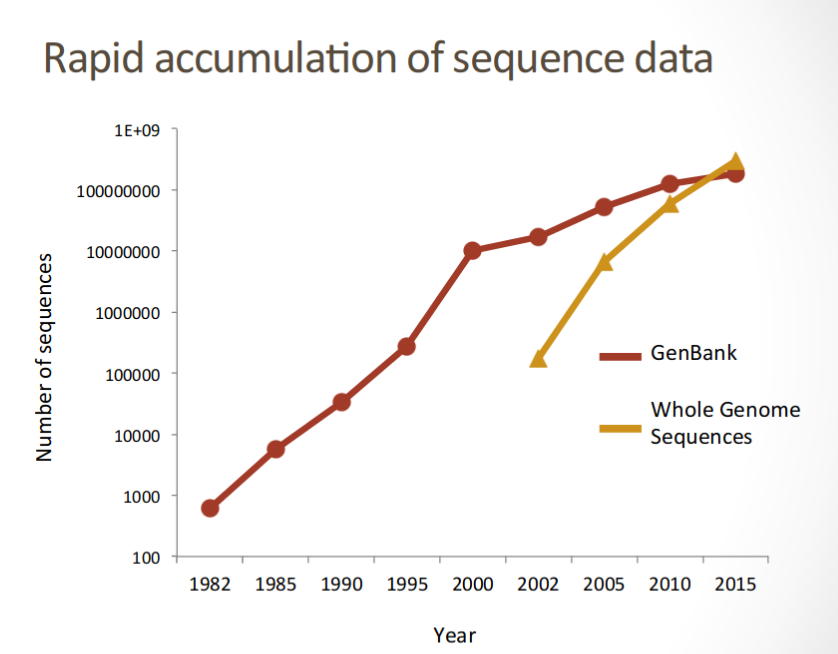
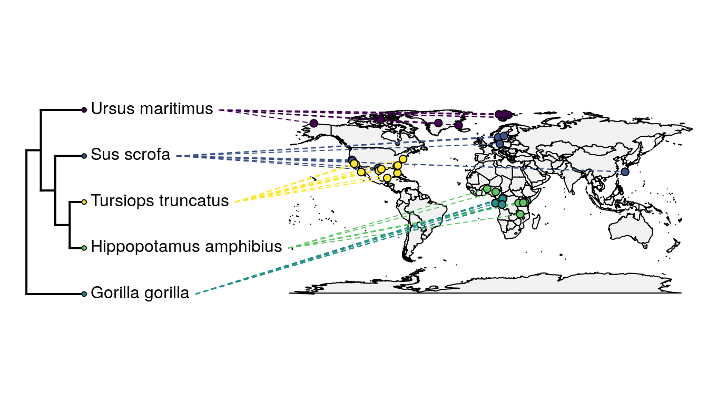

# Comparing and updating phylogenetic trees
### Work in progress - please contact ejmctavish@ucmerced.edu with any issues or questions.


There any many ways to generate phylogenetic trees!
All kinds of data, lots of analysis and methods.
We've talked a lot about tools for estimating trees, but...

**How can we contextualize our phylogenetic inferences in existing literature and taxonomy?**


In this tutorial we will walk through:

  - [The Open Tree of Life resource](mds/the-open-tree-of-life.md)

  - [Standardizing taxon names](mds/tnrs.md)

  - [Getting a subtree for your taxa](mds/getting-a-subtree.md)

  - [Getting existing trees for arbitrary sets of taxa] (#)

  - [Uploading trees to Open Tree of Life] (#)

  - [Visualizing conflict between estimates] (#)

  - [Updating an existing phylogeny with new data from GenBank] (#)


Get the tutorial folder to work on your computer using
```
    git clone https://github.com/snacktavish/OpenTree_SSB2020.git
    cd  OpenTree_SSB2020/tutorial
```

# MODULARIZE ALL THE FOLLOWING TOO

## Comparing trees
Imagine that we want to get some more taxonomic context for our inferences that we made
using IQ-TREE.
How does the tree we estimated during that lab (which we know is contentious) compare to taxonomy and other published literature?

In order to make comparisons about statements that two different trees are making about the same set of taxa, we need to make sure the labels on the tree match.

We will use our same taxonomy mapping file to match the tips of our estimated tree to the standardized labels in Open Tree.

Open 'tutorial/rename_tips.py'.

This is a very simple script that takes your mapped labels, and uses the conversion from 'original name' to replace the tip names on your tree with the standardized names

Run this file. If you want to, replace the path to my turtle tree ('turtle_iqtree.tre') estimate with another tree you estimated or obtained from the literature.
```
  $ python rename_tips.py
```
This should generate a file labelled 'turtle_iqtree_OTT.tre'

Transfer this file to your computer.

### Using Phylo.io to compare two trees.
A quick way to visualize even fairly large trees is
http://phylo.io/

If you have trees with matching labels, you can do a quick comparison.

Upload both trees to phylo.io

**Q** Is your tree inference different than the relationships from OpenTree?

**Q** How so?

## Taxon re-naming
'Podarcis' is missing from the tree downloaded from OpenTree, and is replaced with a node labelled 'mrca'.

Let's look at the synthetic tree to see what is going on!

https://tree.opentreeoflife.org/opentree/argus/ottol@937560/Podarcis


## Automated updating of an existing tree
There is a lot of sequence data that has been generated, but has never been incorporated into any phylogenetic estimates.
We only store phylogenies and associated metadata in OpenTree, not alignments.

### Updating gene trees

However, if you have access to a single gene alignment, and a tree, you can automate adding homologous data into your tree by searching GenBank.

While genome scale data is increasing rapidly - there are still large quantities of gene-sequence data being uploaded to NCBI GenBank.



These data are often appropriate for looking at phylogenetic relationships.

Using Physcraper we can use Blast to search for loci that are likely to be homologous to sequences in an existing alignment.
By using a starting tree and alignment, Physcraper, takes advantage of loci that previous researchers have assessed and deemed appropriate for the phylogentic scope.
The search is limited to taxa that have been labeled as taxa within a user specified taxon or monophyletic group, or within the ingroup of the starting tree.

These automated tree can provide a quick inference of potential relationships, of problems in the taxonomic assignments of sequences, and flag areas of potential systematic interest.

We will update https://tree.opentreeoflife.org/curator/study/view/ot_350
Crous P.W., Verkley G., Christensen M., Castaneda-ruiz R.F., & Groenewald J.Z. 2012. How important are conidial appendages?. Persoonia, 28: 126-137.

We'll walk through the configuration file 'aws.config' , and the script 'data_scrape.py' together, and then run it.

```
  $ python data_scrape.py
```
(NB this script has been taking around 30 minutes on the cluster)
The output is (perhaps overly) verbose. Take a look at it!
Don't worry about the 'skipping acc xxxx, incorrect format' warnings. Those are RNA results which Physcraper cannot currently handle.

One it is done running, take a look at the output:

**Q)** What is the MRCA of the sampled taxa?

**Q)** How many new sequences were found?

**Q)** How many new taxa?


While this analysis is running, I will demonstrate uploading the updated tree file to https://devtree.opentreeoflife.org/curator

**For real analyses, you would want to bootstrap your tree!**
But for in lab that is slow, so we will just look at the ML tree.
This example ML tree actually has low support.


### Uploading your own tree to OpenTree for interactive comparison with the OpenTree synthetic tree and Taxonomy


I will do a demonstration of how to upload your inference tree to OpenTree using the curator sites,
but if you want to try it out yourself later, there are detailed instructions at:
https://github.com/OpenTreeOfLife/opentree/wiki/Submitting-phylogenies-to-Open-Tree-of-Life

When experimenting with OpenTree, or doing demos that upload data, **please** use our development site,
https://devtree.opentreeoflife.org/curator
There will be a red 'Development' banner in the corner!

To upload your published trees, go to
https://tree.opentreeoflife.org/curator


##  Exercise


A student is studying jellyfish that live in Jellyfish Lake in Palau.
Check out https://www.youtube.com/watch?v=DhpaqFya2pg for a cool video of them swimming around!
They are in genus 'Mastigias'. They need to assemble a transcriptome, and wants to use an assembled reference genus.
There are genomic resources available in the genera Cassiopea, Aurelia and Rhopilema.
*Which genome should they use to assemble their transcriptome?*


**Q)** What are the relationships among these taxa? Which taxon is most closely related to mastigias?

**Q)** What studies support this inference?

One of the genera got renamed! Why?
Look in the synthetic tree, to assess what has happened.

**Q)**  Which genus?

**Q)**  What phylogenetically supported three-taxon relationship breaks up this genus?

**Q)**  Is there conflict between the phylogenetic studies that traverse this part of the tree?


## Choose your own adventure!
If there is time, try one of the ideas below.

### Get a synthetic tree
Make a list of taxa you are interested in and save it in a text file.
(Scientific names only)

Resolve those names to Open Tree identifiers, and modify `get_tree.py` to get a tree for your taxa of interest.


### Contribute to OpenTree

Take a look at the area of the synthetic tree that is interesting to you.

Do you have, or know of a published tree that would do a better job on those relationships, but it isn't included in the synthetic tree?

Upload it to the main website  https://tree.opentreeoflife.org/curator, and those phylogenetic inferences will be incorporated into later drafts of the synthetic tree!


### Update a different tree from OpenTree

There are some alignments in the alignments folder labelled as 'StudyIdTreeId.aln'.
Check out what the studies are
by going to https://tree.opentreeoflife.org/curator/study/view/{StudyId}
*Replace StudyId with the id of the study you are interested in*

If any of them interest you, try to scrape data for those taxa, by modifying data_scrape_alt

Upload your extended tree to https://devtree.opentreeoflife.org/curator
(requires a github login)


### Update your own alignment and  tree file!

If you have:
  * an alignment (single gene)
  * a tree

You can automatically update your own tree using physcraper.

Generate a name-mapping file using the Bulk TNRS.

then
follow the example and instructions in `own_data_scrape.py`

This doesn't work well currently for more than 50 taxa.

### Unifying geographic and phylogenetic data using R/Rstudio
There is a great package, [Rotl](https://github.com/ropensci/rotl) that makes it easy to access and work with OpenTree data in R.

Try it out using either:
Tutorial on rotl at, https://ropensci.org/tutorials/rotl_tutorial/
Tutorial on linking data from OpenTree with species locations from GBIF,
https://mctavishlab.github.io/BIO144/labs/rotl-rgbif.html




### Zoom around

Brain a bit tired? There are some fun visualizations of the OpenTree tree.

Take a look around OneZoom https://www.onezoom.org/ tree of life explorer

or this emoji hyperbolic tree https://glouwa.github.io/


---
